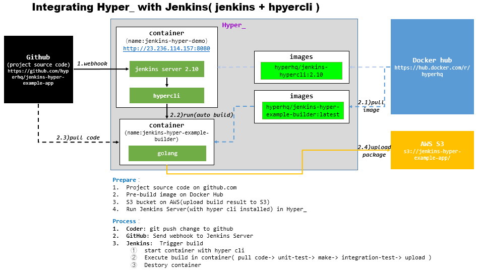

#Solution

There are two ways to integrate Jenkins with Hyper_
1. Jenkins + hyper-plugin ( require hyper api for java, not ready )
2. Jenkins + hyper cli ( require hyper command line )

This demo will show the 2nd way.

> Here is the diagram

